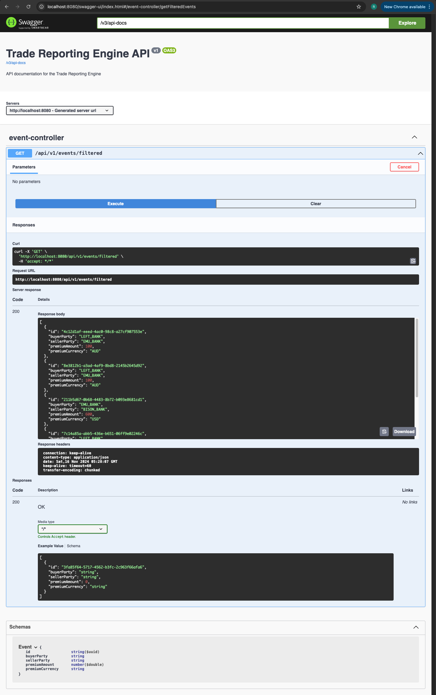

# Trade Reporting Engine

## Overview
This is a Spring Boot application for trade reporting. It uses PostgreSQL as the database and JaCoCo for code coverage.

## Prerequisites
- Java 21
- Gradle
- PostgreSQL
- Git

## Setup Instructions

- Clone the Repository
- Replace DATASOURCE_USERNAME & DATASOURCE_PASSWORD with your PostgreSQL username and password in your environment variables.
```
export DATASOURCE_USERNAME=your_username
export DATASOURCE_PASSWORD=your_password
```

### Build and Run the Application
```shell
  ./gradlew clean build
  ./gradlew bootRun
```

### Test the Application

Swagger API documentation is available for this project. You can access it by running the application and navigating to the following URL in your browser:
```shell
  http://localhost:8080/swagger-ui.html
```

Test the API in CLI/Postman
```shell
  curl -X GET http://localhost:8080/api/v1/events/filtered
```

Test Coverage with JaCoCo
```shell
  ./gradlew test jacocoTestReport
```

Security Vulnerability Dependency Check
```shell
  ./gradlew dependencyCheckAnalyze
```

### Database Setup
The PostgreSQL database is created and initialized by the application. The database name is `tradereporting`.

Connect to the PostgreSQL database:  
```shell
  psql -d tradereporting -U tradereporting_a
```

List the tables to verify if the Events table was created:  
```shell
  \dt
```

Query the Events table to check if rows were inserted:  

```sql
SELECT * FROM Events;
```


